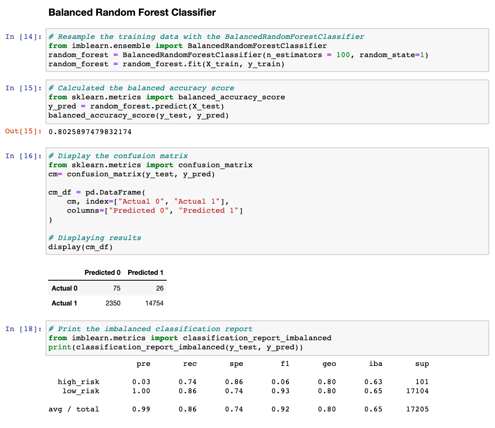

# Credit_Risk_Analysis

## Overview
Jill commends you for all your hard work. Piece by piece, you’ve been building up your skills in data preparation, statistical reasoning, and machine learning. You are now ready to apply machine learning to solve a real-world challenge: credit card risk.

Credit risk is an inherently unbalanced classification problem, as good loans easily outnumber risky loans. Therefore, you’ll need to employ different techniques to train and evaluate models with unbalanced classes. Jill asks you to use imbalanced-learn and scikit-learn libraries to build and evaluate models using resampling.

Using the credit card credit dataset from LendingClub, a peer-to-peer lending services company, you’ll oversample the data using the RandomOverSampler and SMOTE algorithms, and undersample the data using the ClusterCentroids algorithm. Then, you’ll use a combinatorial approach of over- and undersampling using the SMOTEENN algorithm. Next, you’ll compare two new machine learning models that reduce bias, BalancedRandomForestClassifier and EasyEnsembleClassifier, to predict credit risk. Once you’re done, you’ll evaluate the performance of these models and make a written recommendation on whether they should be used to predict credit risk.

With the help of machine learning algorithms, we are going to attempt to predict credit risk. We plan to use several techniques to utilize different models:
- RandomOverSampler
- SMOTE
- ClusterCentroids
- SMOTEEN
- BalancedRandomForestClassifier
- EasyEnsembleClassifier

## Results

### Naive Random Oversampling
- The calculated balanced accuracy score we received was 66% which is considerably low.
- The high_risk precision we received was 1% with a 66% recall. Again, considerably low.

### SMOTE Oversampling
- The calculated balanced accuracy score we received was 63% which is considerably low.
- The high_risk precision we received was 1% with a 61% recall. Again, considerably low.

### Undersampling ClusterCentroids
- The calculated balanced accuracy score we received was 53% which is considerably low.
- The low_risk precision we received was 99% with a 45% recall. 

### Combination Sampling with SMOTEENN
- The calculated balanced accuracy score we received was 67% which is considerably low.
- The low_risk precision we received was 99% with a 60% recall. 

### Balanced Random Forest Classifier
- The calculated balanced accuracy score we received was 80%.
- The low_risk precision we received was 99% with a 86% recall. 

### Easy Ensemble AdaBooster Classifier
- The calculated balanced accuracy score we received was 93% which is considerably low.
- The low_risk precision we received was 99% with a 94% recall. 

## Summary
Based on our findings, the best performance model to use to predict credit risk was Easy Ensemble. The recall score, high balanced accuracy score and the high precision score all played a role in making Easy Ensemble the best performance model.
